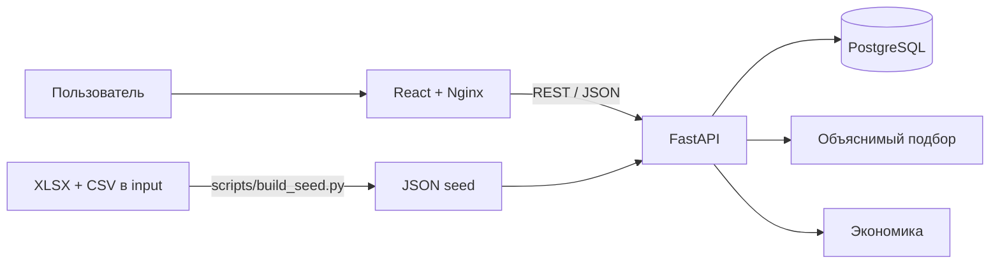

# Архитектура

Frontend использует React Router, TanStack Query/Table, React Hook Form/Zod-подготовку и ECharts. Backend — один FastAPI-процесс с SQLModel/SQLAlchemy. Это намеренный модульный монолит: меньше операционных рисков и единая транзакционная модель для хакатонного MVP.

Авторизация — JWT HS256, пароль — scrypt с индивидуальной солью. Проверка владельца выполняется на сервере; чужой проект возвращает 404, чтобы не раскрывать его существование. Rate limit входа действует в памяти одного процесса и должен быть перенесён в общее хранилище перед горизонтальным масштабированием.

