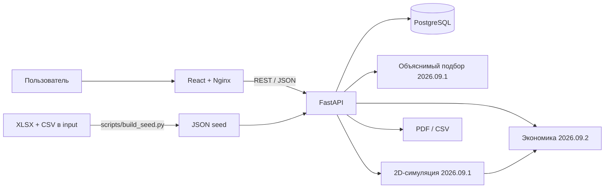

# Архитектура

Frontend использует React Router, TanStack Query/Table, React Hook Form, ECharts и React Konva. Тяжёлые экраны экономики и симуляции загружаются лениво. Backend — один FastAPI-процесс с SQLModel/SQLAlchemy. Это намеренный модульный монолит: меньше операционных рисков и единая транзакционная модель для MVP.

Подбор, экономика и симуляция отделены от UI. Формулы детерминированы и покрыты unit-/API-тестами. Экономика использует результат симуляции только при совпадении ревизии плана; устаревший запуск не превращается в актуальную мощность.

PDF строится из внутреннего Jinja2-шаблона с autoescape. WeasyPrint запрещено загружать внешние ресурсы. CSV экранирует значения, которые табличный редактор может выполнить как формулу.

Авторизация — JWT HS256, пароль — scrypt с индивидуальной солью. Проверка владельца выполняется на сервере; чужой проект возвращает 404. Production отклоняет стандартный или короткий JWT-ключ. Rate limit входа и экспорта действует в памяти одного процесса и должен быть перенесён в общее хранилище перед горизонтальным масштабированием.

Будущий vision-контур остаётся отдельным worker/provider и возвращает только `DraftPlan`; он не получает прямого доступа к БД, `.env` или сети. Спецификация: [local-vision-model.md](local-vision-model.md).