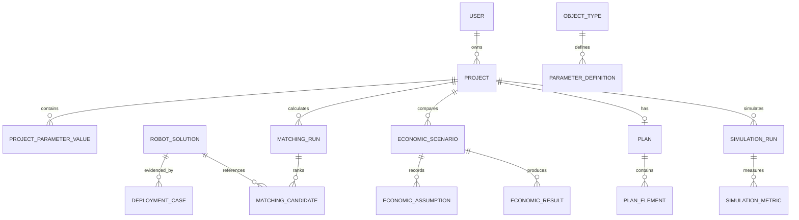

# Модель данных

`RobotSolution` — технический продукт. `DeploymentCase` — контекст внедрения. `SourceEvidence` — источник и статус доказательства. Разделение предотвращает перенос результата одного внедрения в ТТХ продукта без основания.

Пользовательское изменение параметра сохраняет исходное и текущее значение, автора, время и статус `assumed`.

`Plan` имеет номер ревизии, размеры в метрах и статус источника. `PlanElement` хранит тип, геометрию и внешний ключ в пределах плана; комбинация проекта и ключа уникальна. Схема P0 поддерживает storage, obstacle, pickup, dropoff и charger.

`SimulationRun` неизменно сохраняет ревизию плана, версию модели, полный снимок входа и результата. `SimulationMetric` хранит значение, единицу и статус. Поэтому отчёт может отличить актуальную симуляцию от запуска старой ревизии.

Будущий распознаватель сначала создаёт отдельный `DraftPlan` с provenance/confidence; эта сущность не добавлена в БД до реализации безопасной загрузки и ручного подтверждения.