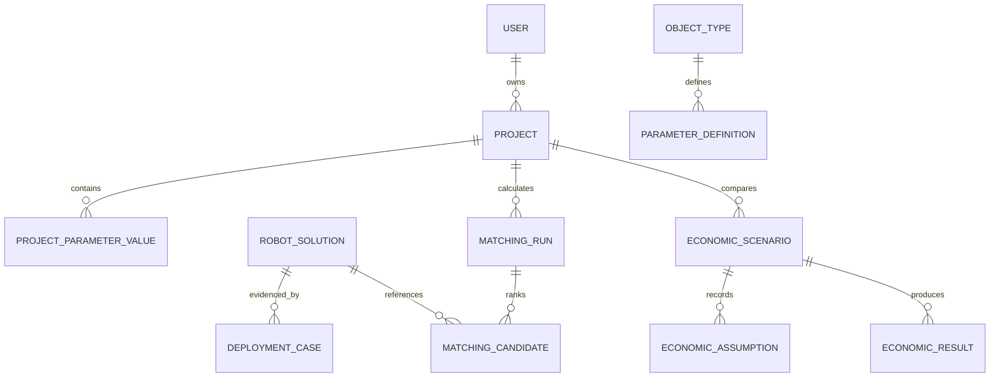

# Модель данных

`RobotSolution` — технический продукт. `DeploymentCase` — контекст внедрения. `SourceEvidence` — источник и статус доказательства. Разделение предотвращает перенос результата одного внедрения в ТТХ продукта без основания.

Пользовательское изменение параметра сохраняет исходное и текущее значение, автора, время и статус `assumed`.

